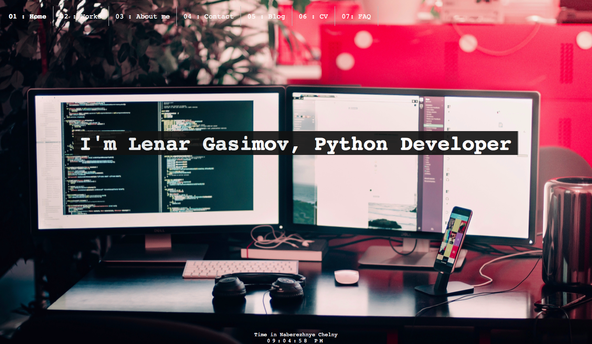
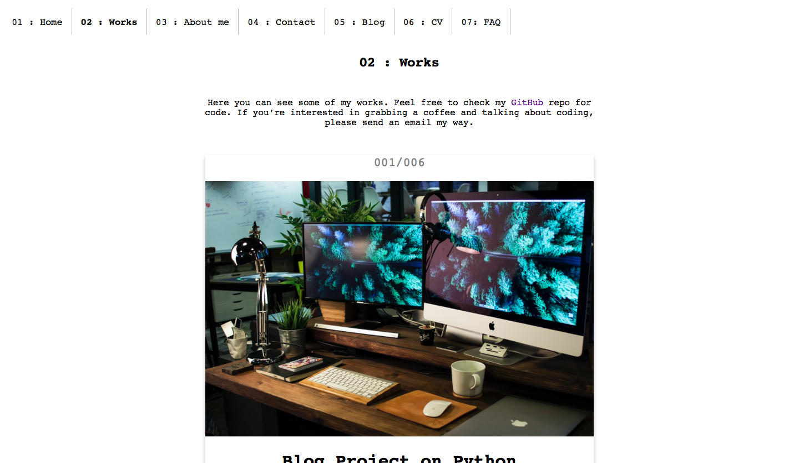
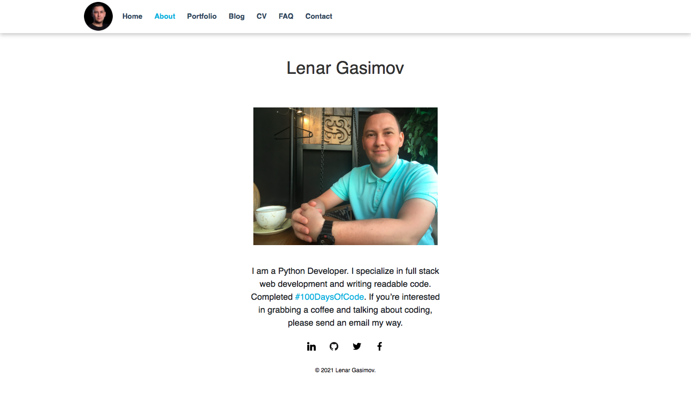
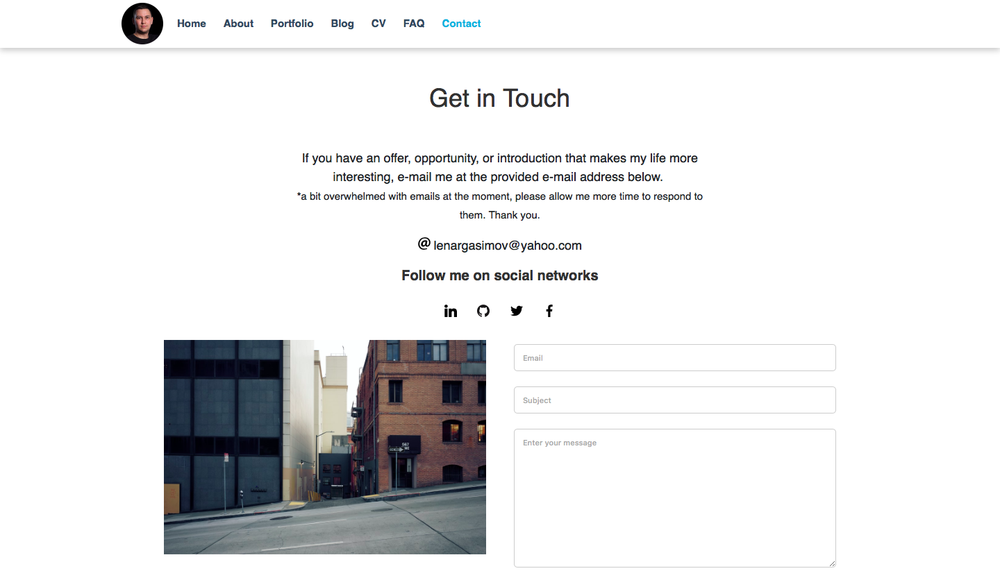
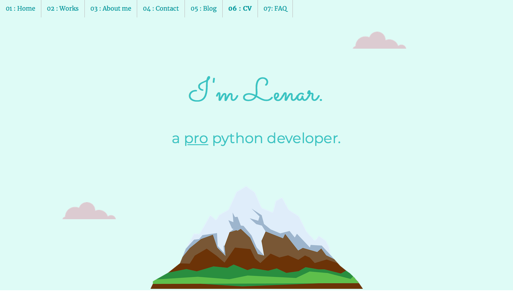
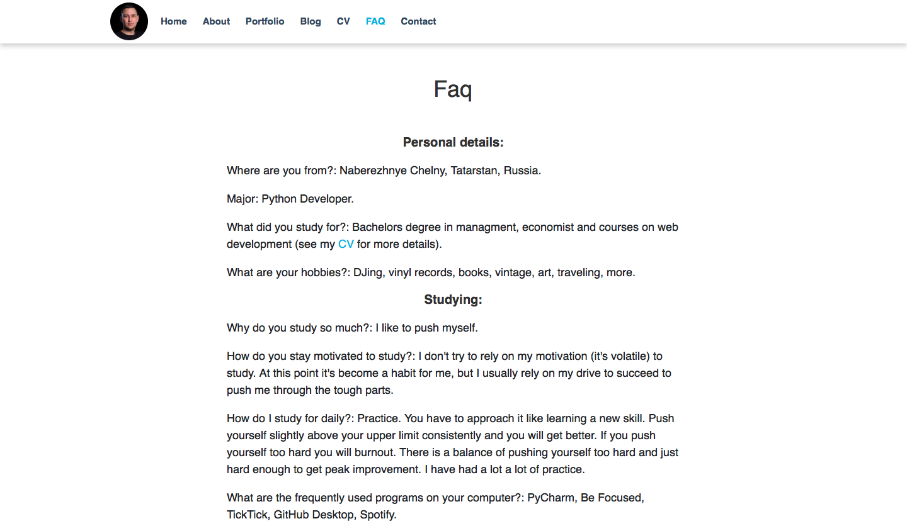

# Portfolio 

On this website, I document interesting things I learned and share my experience with you.

## Features

🛠 `Portfolio`

🌿 `About me`

📬 `Contact`, send a email through the feedback form

☕ `CV`

🔮 `FAQ`

Main            |  Works
:-------------------------:|:-------------------------:
  |  

About            |  Contact
:-------------------------:|:-------------------------:
  |  

CV            |  Faq
:-------------------------:|:-------------------------:
  |  

Check out the website at [lenargasimov.dev](https://lenargasimov.dev).

## 👨‍💻 Author

 
  

<b>Lenar Gasimov</b> Python developer | Python, Django, Flask.

 

## 💸 Donations

Feel free to use the :octocat: GitHub Sponsor button to donate towards my work if you're feeling generous ☕️

<h4>

🚧 Under construction... 🚧

</h4>