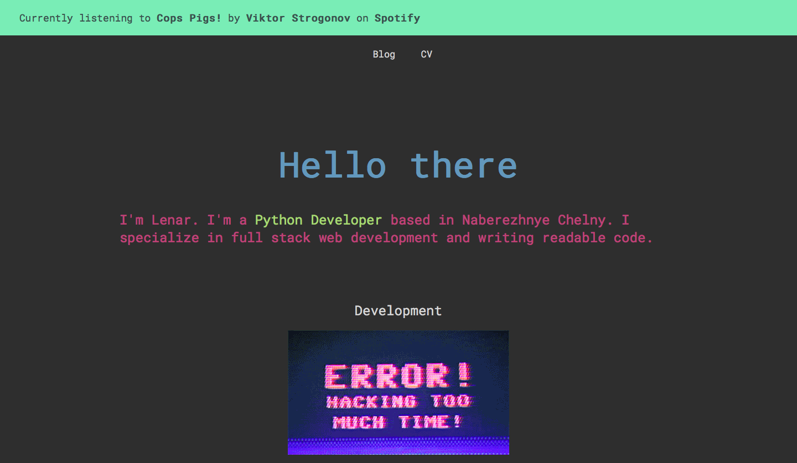

<h1 align="center">CV
    
</h1>

    
    
    

On this website, I document interesting things I learned and share my experience with you.

Check out the website at [lenargasimov.dev](https://lenargasimov.dev).

- HTML 5
- CSS 3
- JS

---

## Author

 
  

<b>Lenar Gasimov</b> Python developer | Python, Django, Flask.

    

